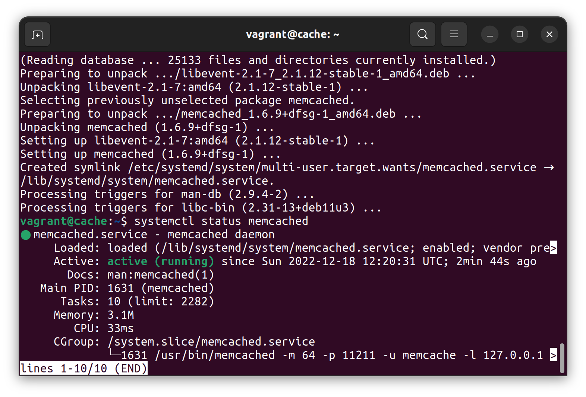
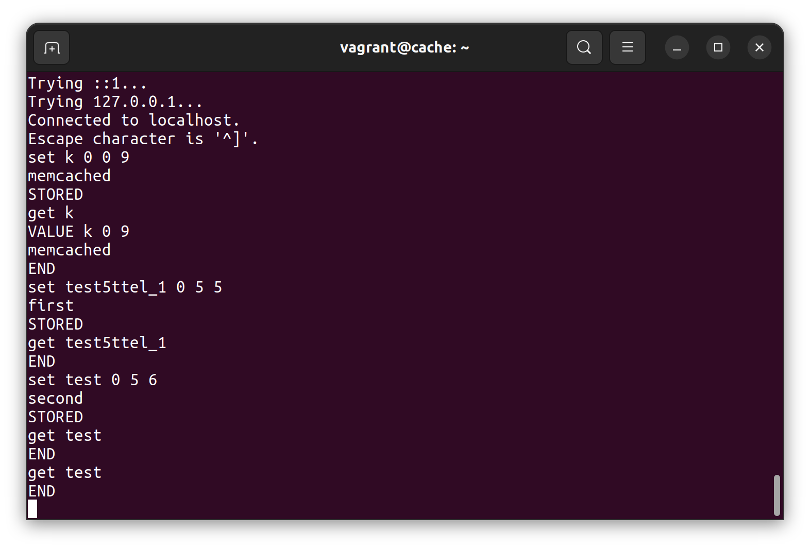
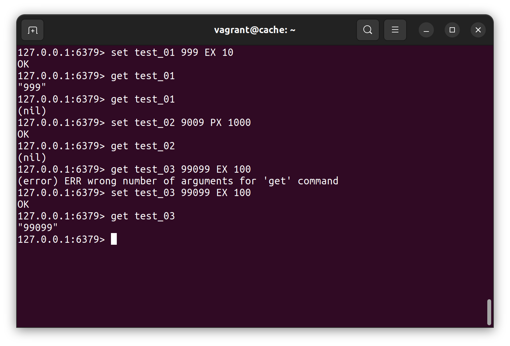
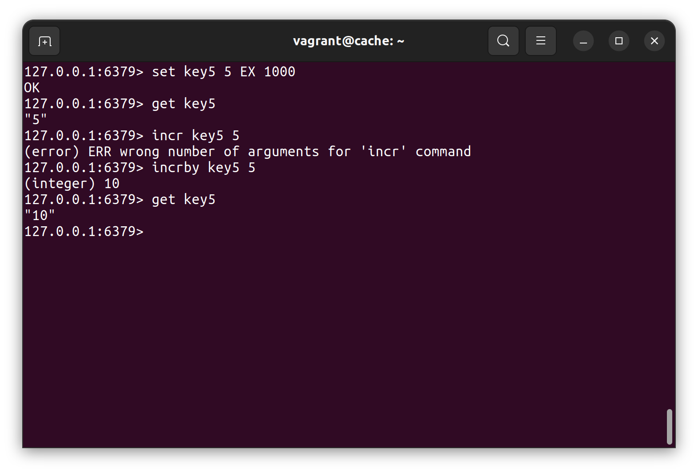

# 11.2 Кеширование Redis/memcached - Александр Гумлевой
### Задание 1. Кэширование.

Приведите примеры проблем, которые может решить кэширование.

Высокая нагрузка на
1. приложение (можно результат работы приложения сохранять в кэше);
2. СУБД (результаты запрососв к БД можно хранить в кэше);
3. сеть (можно хранить запрашиваемые клиентами данные в регионально распределенном кэше (например CDN) для получения их с ближайшего сервера);
4. память (пример - использование многоуровневого кэша процессора для ускорения доступа к данным).

### Задание 2. Memcached.

Установите и запустите memcached.

Приведите скриншот systemctl status memcached, где будет видно, что memcached запущен.

### Задание 3. Удаление по TTL в Memcached.

Запишите в memcached несколько ключей с любыми именами и значениями, для которых выставлен TTL 5.

Приведите скриншот, на котором видно, что спустя 5 секунд ключи удалились из базы.

### Задание 4. Запись данных в Redis.

Запишите в redis несколько ключей с любыми именами и значениями.

Через redis-cli достаньте все записанные ключи и значения из базы, приведите скриншот этой операции.

### Задание 5*. Работа с числами.

Запишите в redis ключ key5 со значением типа "int" равным числу 5. Увеличьте его на 5, чтобы в итоге в значении лежало число 10.

Приведите скриншот, где будут проделаны все операции и будет видно, что значение key5 стало равно 10.

